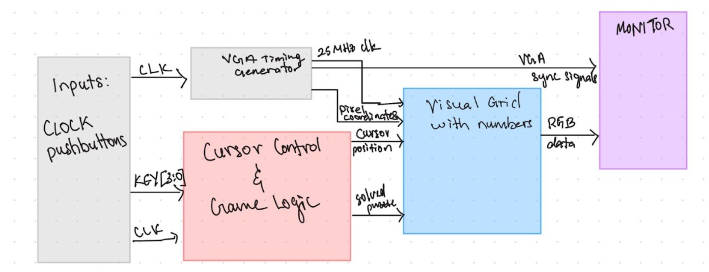
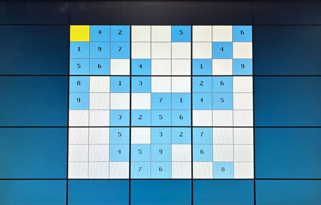

# FPGA Sudoku ♟️
A UNLV-based geolocator, using a self-captured database of over 6000+ images. Utilizing a machine learning algorithm, a dynamically trained Convolutional Neural Network, and extracted coordinate metadata for image recognition and scene labeling to accurately predict an image location.

🔗 **[Demo](https://docs.google.com/presentation/d/1jEWr0fbyxk2inhwl8PLDxwv0RK3vw9eix7i5ZpTqZuY/edit?usp=sharing)**

## Project Overview 💾
FPGA Sudoku was built through several hardware and digital components working simultaneously to generate the puzzle application:
1. **Cursor and Input Control**
2. **Board Memory and Logic**
3. **Visuals and Display**

The pipeline begins with the FPGA hardware inputs and ends with digitally holding and displaying the given values; the exact traces are shown in the diagram below.

<p align="center">
  
</p>

## 1. Cursor and Input Control
Player controls and inputs are registered entirely through the FPGA hardware, specifically the switches and pushbuttons.

- Cursor navigation is handled through the pushbuttons, with the left-most button acting as the "right" movement key, the next as "left", then "up" and "down".

- The number values are input through the switches, with the left-most switch acting as the Enter key, allowing a player to continue inputting values until they confirm it through this action.

- The board registers each switch past the "Enter" as counting up from 1 to 9, allowing for easy-to-understand controls, as it overrides the default binary inputs for numerical values.
  - This effect was created by retrieving character graphics in the form of bitmap pixel data from a character ROM lookup table. Therefore, each number input is technically a pixel drawing of the number that is then output to the board as a graphic.

## 2. Board Memory and Logic
The 9x9 Sudoku board is pulled from a pre-existing puzzle board and loaded as a text document onto the grid drawing module. 

- To sync the FPGA board to the Computer Monitor, the internal clock had to be tweaked to the same frequency as the VGA input cable, that being a 25 MHZ Clock.

- The board is classified as a painted object as it uses pixel coordinates to determine the color and category of every pixel on the display screen.

- A priority-based color encoder determines which object is displayed whenever graphics overlap, allowing for multiple painted objects to be displayed at the same time. This effect works best when inputting a number onto an already occupied cell, where the number takes priority and is displayed on the top layer.

## 3. Visuals and Display

- The grid is drawn to match the original visual style of the Sudoku Board, with thin borders separating each cell and thick borders for every cell cluster or 3x3 region.

- Each cell is color-coded depending on the user input, where empty cells are white and filled cells are a dark blue.

- As the cursor is moved across the grid, the cell where the cursor currently resides will be highlighted yellow to give a clear indication of where the user is on the board.

An example of the cursor being displayed on a board with pre-set numbers is shown below.

<p align="center">
  
</p>

# Project Structure 📁
```
FPGA-Sudoku/
│
├── src/
│   ├── cursorControl.sv
│   ├── gridDrawer.sv
│   ├── inputRom.sv
│   ├── VGAsync.sv
│   └── VGAwrapper.sv
│
├── testbench/
│   ├── tb_cursor.sv
│   ├── tb_wrapper.sv
│   └── testbench.sv
│
├── !QUARTUS
│   ├── charrRom.txt
│   ├── SUDOKU.qpf
│   ├── SUDOKU.qsf
│   └── ...
│
└── Board.txt
```
